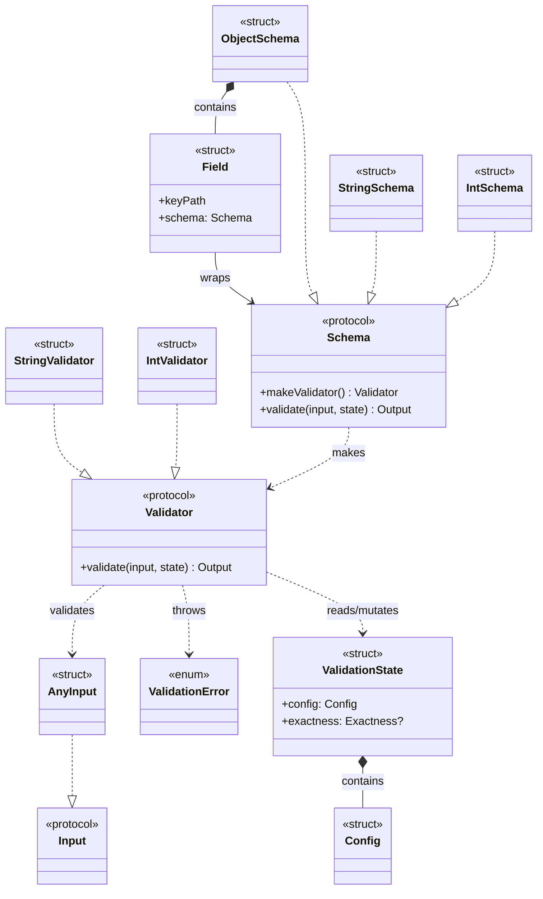

## Architecture

```mermaid
classDiagram
    class Config { <<struct>> }
    class ValidationState {
        <<struct>>
        +config: Config
        +exactness: Exactness?
    }
    class ValidationError { <<enum>> }
    class Input { <<protocol>> }
    class AnyInput { <<struct>> }
    class Field {
        <<struct>>
        +keyPath
        +schema: Schema
    }
    class Schema {
        <<protocol>>
        +makeValidator() Validator
        +validate(input, state) Output
    }
    class ObjectSchema { <<struct>> }
    class StringSchema { <<struct>> }
    class IntSchema { <<struct>> }
    class Validator {
        <<protocol>>
        +validate(input, state) Output
    }
    class StringValidator { <<struct>> }
    class IntValidator { <<struct>> }

    AnyInput ..|> Input
    ObjectSchema *-- Field : contains
    Field --> Schema : wraps

    ObjectSchema ..|> Schema
    StringSchema ..|> Schema
    IntSchema ..|> Schema

    StringValidator ..|> Validator
    IntValidator ..|> Validator
    Schema ..> Validator : makes
    Validator ..> AnyInput : validates
    Validator ..> ValidationState : reads/mutates
    Validator ..> ValidationError : throws
    ValidationState *-- Config : contains
```
